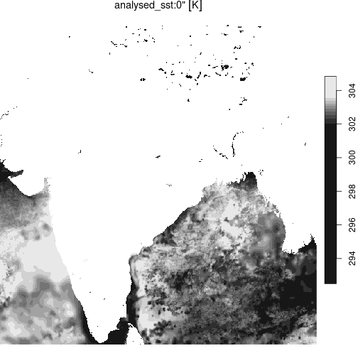

# Data Formats

This vignette illustrates cloud-native access of across a range of
common formats, including netcdf, Zarr, hdf5, hdf4, and COGs.

(Right now these are somewhat generic examples, not necessarily based on
NASA’s EarthData sources and therefore not requiring authentication, but
the workflow should be identical after calling
[`edl_set_token()`](https://boettiger-lab.github.io/earthdatalogin/reference/edl_set_token.md))

``` r
library(stars)
library(terra)
```

## netcdf, 1 GB file

Cloud-read data from a public AWS S3 bucket, over https:

``` r
url <- paste0("https://era5-pds.s3.amazonaws.com",
              "/1979/01/data/air_pressure_at_mean_sea_level.nc")
r <- terra::rast(url, vsi=TRUE)
r
#> class       : SpatRaster 
#> dimensions  : 721, 1440, 744  (nrow, ncol, nlyr)
#> resolution  : 0.25, 0.25  (x, y)
#> extent      : -0.125, 359.875, -90.125, 90.125  (xmin, xmax, ymin, ymax)
#> coord. ref. :  
#> source      : air_pressure_at_mean_sea_level.nc 
#> names       : air_p~vel_1, air_p~vel_2, air_p~vel_3, air_p~vel_4, air_p~vel_5, air_p~vel_6, ... 
#> unit        :          Pa,          Pa,          Pa,          Pa,          Pa,          Pa, ...
```

Cloud read of the same data, over S3 protocol:

``` r
Sys.setenv("AWS_NO_SIGN_REQUEST"=TRUE)
s3uri <- "s3://era5-pds/1979/01/data/air_pressure_at_mean_sea_level.nc"
r <- terra::rast(s3uri)
Sys.unsetenv("AWS_NO_SIGN_REQUEST")
```

## Zarr, 31 TB

Cloud read of a 31 Terrabyte Zarr archive (S3, public https)

``` r
url <- "https://mur-sst.s3.us-west-2.amazonaws.com/zarr-v1"
prefixes <- 'ZARR:\"/vsicurl/'
slice <- '\":/analysed_sst:0"'
addr <- paste0(prefixes, url, slice)
y = terra::rast(addr)
```

``` r
library(tmap)
data(World)

india <-st_bbox( World$geometry[World$name == "India"] )
```

``` r
st_as_stars(y) |>
  st_crop(india) |>
  plot()
```



plot of chunk zarr_sst
