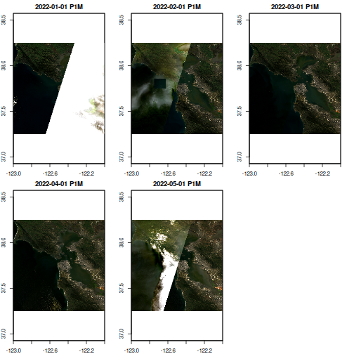
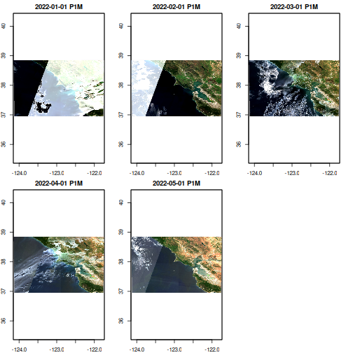

High-resolution satellites generate many snapshot images each with a limited field of view or spatial extent.  In order to see a larger area in space, and/or observe changes across space and time, we need to assemble these many snapshots into a mosaic or "data cube" that we can analyze as a cohesive whole. 


[EARTHDATA STAC CATALOGS](https://radiantearth.github.io/stac-browser/#/external/cmr.earthdata.nasa.gov/stac/)


``` r
library(rstac)
library(gdalcubes)
gdalcubes_options(parallel = TRUE) 
```


### Earth Data Authentication

First let's get EDL authentication out of the way.
For cloud data from almost any other STAC catalog (NOAA, USGS, Planetary Computer, etc), authentication is either unnecessary or already provided by the STAC API, but NASA EDL is special. 

As usual, we can handle this with `edl_netrc()`.  Because the `gdalcubes` package doesn't respect global environmental variables, we use a helper utility to export those into it's configuration as well. 


``` r
library(earthdatalogin)
edl_netrc()
with_gdalcubes()
```


## Search via STAC

We will now use the `rstac` package to search one or more NASA collections for data that falls into our desired bounding box of space and time:


``` r
url <- "https://cmr.earthdata.nasa.gov/cloudstac/LPCLOUD"
collection <- "HLSL30.v2.0"

bbox <- c(xmin=-123, ymin=37.25, xmax=-122.0, ymax=38.25) 
start <- "2022-01-01T00:00:00Z" # NASA requires this format, other STACs accept date-only
end <- "2022-05-31T00:00:00Z"


# HLSL30 is landstat-conventions harmonized, HSLS30 is sentinel-conventions in harmonized
# Find all assets from the desired catalog:
items <- stac(url) |> 
  stac_search(collections = collection,
              bbox = bbox,
              datetime = paste(start,end, sep = "/")) |>
  post_request() |>
  items_fetch()
#> 
  |                                                                                                                            
  |======================================================================================================================| 100%
```

Currently the NASA metadata is missing projection information from `items$features[[1]]$properties`.  
We will read the metadata from the COG directly, though this only works if all images in our field are in the same projection.


``` r
href <- items$features[[1]]$assets[["B04"]]$href

library(terra)
r <- terra::rast(href, vsi=TRUE)
srs <- terra::crs(r)
```


Note that 146 features have matched our search criteria! Each feature represents a 'snapshot' image taken by the satellite as it passes by (this is a harmonized product so actually there's quite a lot of post-processing.)  Each feature thus shares the same bounding box, projection, and timestamp, but may consist of many different 'assets', different COG files representing the different spectral bands on the satellite camera instrument.  Each feature can potentially include quite extensive metadata about the feature, including details of instrument itself or from post-processing, such as cloud cover.  Unfortunately, EarthData's STAC metadata tends to be quite sparse. 


## Building a Data Cube


``` r
# Desired data cube shape & resolution
v <- cube_view(srs = "EPSG:4326",
               extent = list(t0 = as.character(start), 
                            t1 = as.character(end),
                            left = bbox[1], right = bbox[3],
                            top = bbox[4], bottom = bbox[2]),
               nx = 512, ny = 512, dt = "P1M")
```


``` r
# RGB bands + cloud cover mask
col <- stac_image_collection(items$features, 
                             asset_names = c("B02", "B03", "B04", "Fmask"),
                              # srs not in stac meta, so manually set instead:
                             skip_image_metadata = TRUE,
                             srs = srs
                             )

# use a cloud mask -- see
# https://lpdaac.usgs.gov/documents/1326/HLS_User_Guide_V2.pdf
# or https://github.com/nasa/HLS-Data-Resources
cloud_mask <- image_mask("Fmask", values=c(1,1,1), bits = c(1,2,3))
```

While we can pipe directly to a plot, stashing our resulting downscaled, reprojected cube as a local netcdf file makes it easy to reuse in future calculations:


``` r

cache <- tempfile(fileext = ".nc")

bench::bench_time({
raster_cube(col, v, mask=cloud_mask) |>
  select_bands(c("B02","B03", "B04")) |>
  write_ncdf(cache)
})
#> process    real 
#>   9.89s   2.83m
```

Now we can always load from the local data:


``` r
ncdf_cube(cache) |>  plot(rgb=3:1)
```




## Comparison

Direct AWS Access via element84 STAC collection. Does not include harmonized sentinel-landsat yet, but 
is remarkably faster than NASA's AWS access via earthdatalogin redirections. 


``` r
items <-
  stac("https://earth-search.aws.element84.com/v0/") |>
  stac_search(collections = "sentinel-s2-l2a-cogs",
              bbox = bbox,
              datetime = paste(start, end, sep="/")) |>
  post_request() |>
  items_fetch()
#> 
  |                                                                                                                            
  |======================================================================================================================| 100%

col <- stac_image_collection(items$features, asset_names = c("B02", "B03", "B04", "SCL"))

v <- cube_view(srs = "EPSG:4326",
              extent = col,
              nx = 512, ny = 512, dt = "P1M",
              aggregation ="first", resampling = "near")

mask <- image_mask("SCL", values=c(3, 8, 9)) # mask clouds and cloud shadows

cache <- tempfile(fileext = ".nc")

bench::bench_time({
  raster_cube(col, v, mask=mask) |>
  select_bands(c("B02","B03", "B04")) |>
  write_ncdf(cache, overwrite=TRUE)
  
})
#> process    real 
#>   12.7s   49.4s

ncdf_cube(cache) |>  plot(rgb=3:1)
```



